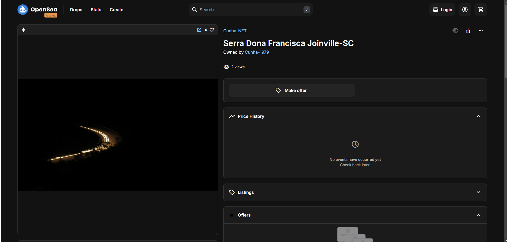

> ### Desafio de aula

# Criando o Seu Primeiro Token NFT na Prática

  

Neste Desafio você irá criar um Token Não Fungível, o famoso NFT, na Blockchain **~~gratuita OpenSea Polygon~~** ***"No ano em que foi gravado o conteúdo da aula e do desafio era gratuito, contudo agora não é mais possivel"***. O projeto foi criado na ***testnet SEPOLIA da Opensea*** já que conseguir faucets da rede Polygon estava se tornando algo oneroso. 

Lembre-se de seguir todas as instruções e o passo a passo fornecidos pelo Instrutor. *"Infelizmente não puderam ser seguidas todas as instruções."*

  

## Iniciando o desafio 

Configurado a Wallet do Metamask para rede SEPOLIA (Testnet da rede Ethereum).
Adquirido faucets de ETH para o GAS.
Criado repositório no [GitHub](https://github.com/Cunha-1979/Desafio-Dio-Criando-um-NFT-na-Pratica).
Abrir no navegador a testnet da [OpenSea](https://testnets.opensea.io/).
Conectar sua Wallet da Metamask pela rede Sepolia, criar primeiro seu contrato com uma Coleção de NFT, feito isto é hora de mintar "criar" seu NFT.
A imagem utilizada é de minhha autoria, sendo vedada a distribuição ou comercialização da mesma.

### Links úteis

[NFT do projeto na OpenSea](https://testnets.opensea.io/assets/sepolia/0xf44381ff81e96be24cc3c2d9efdc21e90853326d/1)

[Carteira MetaMask](https://metamask.io/)​

[Opensea "testnet"](https://testnets.opensea.io/)  

Explorador de bloco da testnet do Sepolia Ethereum com o endereço do contrato do mint NFT.

[EtherScan](https://sepolia.etherscan.io/tx/0x536a0dc6f68ed97b475d7f5d6947c90b1032e60e41e4f7140e9fa7fc7aba4f00)
___

Faucets de Ether (ETH) no **SEPOLIA** que estão funcionando¹:

[Google Cloud Web3](https://cloud.google.com/application/web3/faucet/ethereum/sepolia)

[ChainLink](https://faucets.chain.link/sepolia)
___

### IMAGENS

NFT criado na Opensea

<sob>*Foto autor: [Cunha-1979](https://www.github.com/Cunha-1979)*</sob> 
 
 
 
Tela da OpenSea com o NFT criado

<sob>*Autor: [Cunha-1979](https://www.github.com/Cunha-1979)*</sob> 
 
 
 
EtherScan do endereço do mint  

<sob>*Autor: [Cunha-1979](https://www.github.com/Cunha-1979)*</sob>
 
 
 

___
## Autores

  

- [Cunha-1979](https://www.github.com/Cunha-1979)

- [Ricardo Zago](https://www.linkedin.com/in/ricardozago/) > Instrutor da Dio.
 
 
 
 
 

___
###### DECLARAÇÃO DE DIREITOS AUTORAIS
*Todas as informações incluídas neste repositório, como texto, gráficos, fotos, o logotipo e as imagens, são de propriedade exclusiva de [Cunha-1979](https://github.com/Cunha-1979), mesmo sendo este repositório público, ainda são protegidas pelas leis de direitos autorais nacionais e internacionais. Outros nomes de marcas e logotipos podem ser marcas comerciais ou marcas registradas de outras empresas.
A permissão para visualizar e fotocopiar (ou imprimir) e "printar" materiais deste site é concedida apenas para uso pessoal e não comercial. Qualquer outra cópia, distribuição, retransmissão ou 
modificação das informações contidas neste repositório, na forma eletrônica ou impressa, sem permissão anterior expressa por escrito do proprietário, é estritamente proibida. No caso de qualquer cópia, redistribuição ou publicação será permitida com direitos autorais, nenhuma mudança ou exclusão de atribuição do autor, legenda de marca registrada ou de aviso de direitos autorais deverá ser feita.*
